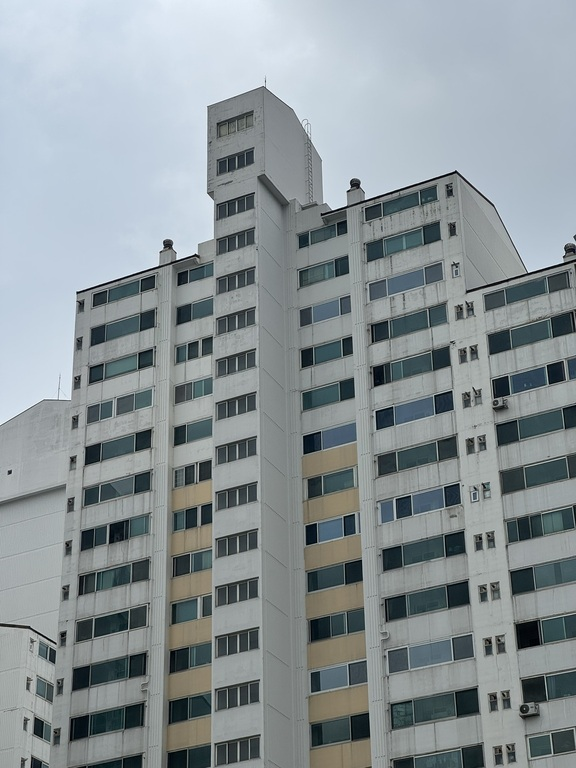
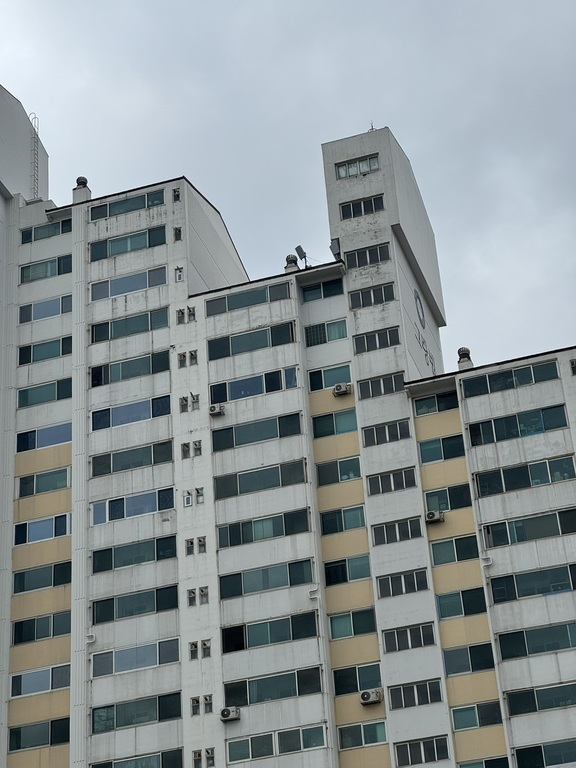
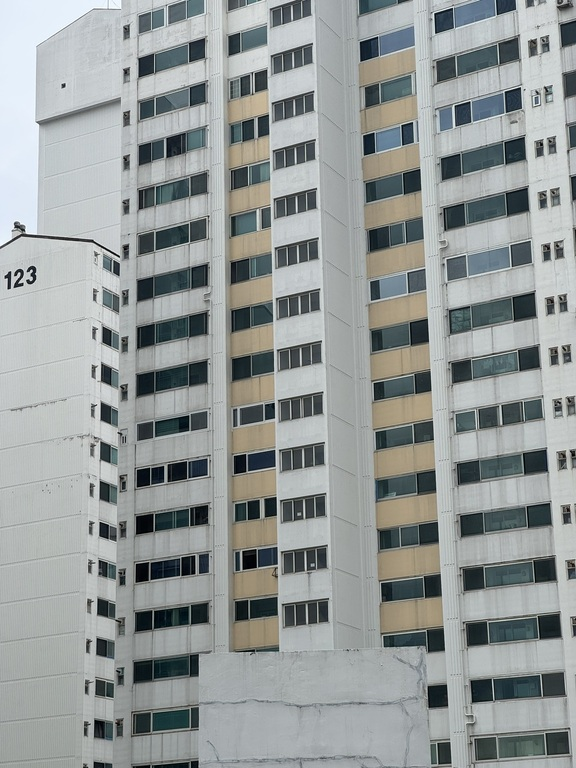
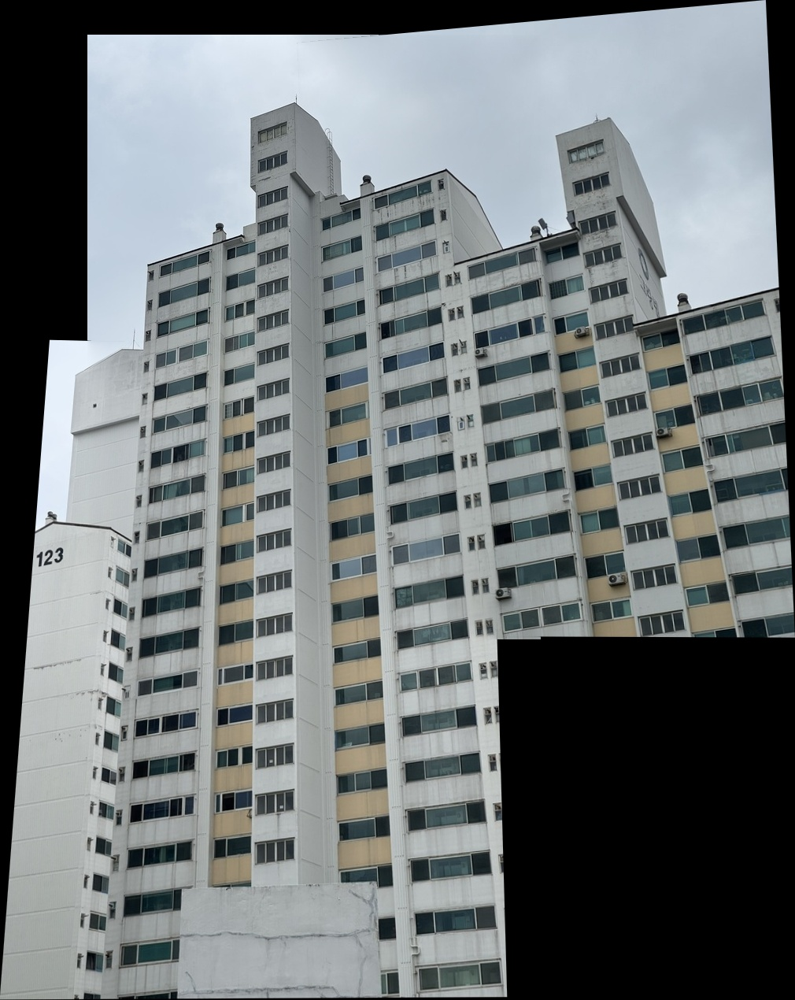

# Panorama_image_stitcher
OpenCV를 활용하여 이미지를 이어붙이는 프로그램입니다.
이 프로그램에서는 3장의 사진을 BRISK로 특징점을 찾고, RANSAC 호모그래피로 합친뒤 Distance-transform 알파 블렌딩으로 경계를 부드럽게 이어붙입니다.

## 요구사항
- Python 
- NumPy
- opencv-python

## 작동원리
1. Brisk 특징점 검출, descriptor 추출
2. Brute-Force Hamming 거리 매칭
3. 인접한 이미지 쌍마다 cv.findHomography, cv.RANSAC 사용
4. 변환된 모서리들로 전체 캔버스 크기 자동으로 계산
5. 음수좌표를 양수영역으로 옮기는 평행이동 행렬 T적용
6. 이미지+마스크를 캔버스에 warp
7. Distance-transform 가중치를 사용한 가중평균 블렌딩

## 사용방법
1. 이미지 3장을 겹치는 부분이 1/3정도 되게끔 촬영하여 data 폴더안에 1.JPEG, 2.JPEG, 3.JPEG 이름으로 저장합니다.
2. main.py 실행합니다.
3. 실행시에 1.JPEG, 2.JPEG를 합친것과 세 이미지를 모두 합친 이미지 미리보기 창이 생성됩니다.
4. 동시에 동일폴더안에 Result.jpg 파일로 최종결과본이 저장됩니다.

## 결과예시
### 원본 이미지 3장 

### 최종이미지

## 사진 촬영시 주의할 점
1. 같은 위치에서 카메라의 방향만 바꿔서 촬영할 것
2. 겹치는 부분이 최소 1/3이상되게 촬영할 것
3. 깊이 차이가 많이 나지 않게 촬영하기(먼거리에 있는 배경 추천)
4. 카메라 노출, 화이트밸런스, 초점 가능하면 고정하기
   (Blending으로 보정하지만 심하면 극복이 안될수있음)

